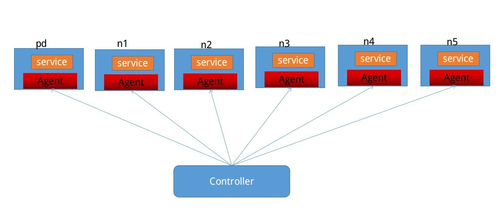

# Chaos

Chaos is used to check the distributed system linearizability.

Chaos is inspired by [jepsen](https://github.com/jepsen-io/jepsen) and uses [porcupine](https://github.com/anishathalye/porcupine) as its linearizability checker.

## Architecture

Chaos runs your registered database on 5 nodes, and starts an agent in every node too. The agent will
receive the command sent from the controller to control the service, like starting/stoping the service, 
or using a nemesis to disturb the whole cluster.




modified to add a node name pd for pd, modified to control service on every node,
modified to no password ssh to nodes from chaos-control, all focus on docker-compose 

## Usage

In one shell, we start the 5 nodes and the controller.

```
cd docker
./up.sh
```

In another shell, use `docker exec -it chaos-control bash` to enter the controller, then:

```console
# start agent
./scripts/start_agent.sh
# setup db software on nodes
/root/chaos-control -action setupdb
# start pd on node pd
/root/chaos-control -action startpd
# start kv on node 1, can be 1,2,3,4,5
/root/chaos-control -action startkv -nodes 1,2,3
# start tidb on node 4
/root/chaos-control -action starttidb -nodes 4
# init tables and run, then linearization checking
/root/chaos-control -action run -nodes 4 -initData
```


